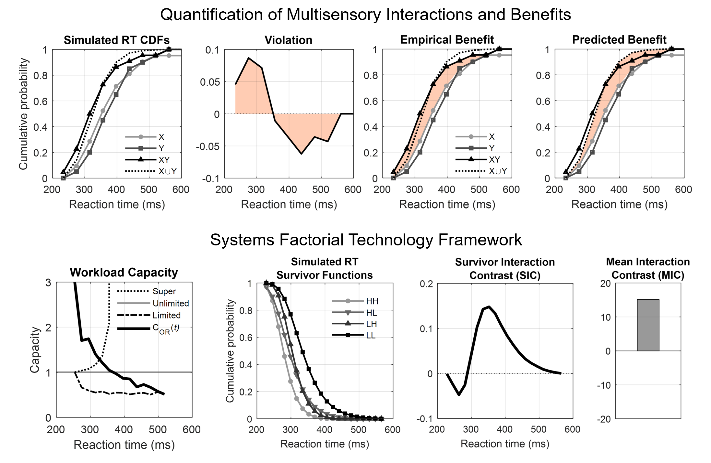

# RaceModel
RaceModel is a MATLAB package for stochastic modelling of multisensory reaction times (RTs). It is suitable for analyzing empirical data or running simulations, and can handle datasets of unequal sizes and with missing values (NaNs). The toolbox can be used to build parallel models of multisensory information processing for both OR and AND task designs (e.g., the race model; Miller, 1982), as well as bisensory and trisensory paradigms. Parallel models can be generated under the assumption that RTs on separate sensory channels are stochastically independent (independent race model), perfectly negatively dependent (Miller's bound) or perfectly positively dependent (Grice's bound), and can be tested using either the vertical or horizontal method. Separate functions compute geometric measures of multisensory gain (violation), multisensory benefit (Otto et al., 2013) and modality switch effects.

RaceModel also includes a *systems factorial technology* framework for inferring system architecture and measuring the workload capacity of a system (Townsend & Nozawa, 1995). The latter can also be assessed for OR/AND tasks and bisensory/trisensory paradigms. System architecture can also be examined using a novel framework for biasing the stopping rule (Crosse et al., 2019). The toolbox also includes an outlier correction procedure for cleaning data prior to testing. For statistical analyses, we recommend using multivariate permutation tests with *tmax* correction. This method provides strong control of family-wise error rate, even for small sample sizes, and is much more powerful than traditional methods (Gondan, 2010). We provide a separate MATLAB toolbox for multivariate permutation testing here: [PERMUTOOLS](https://github.com/mickcrosse/PERMUTOOLS "PERMUTOOLS").

### Documentation
Crosse MJ, Foxe JJ, Molholm S (2019) RaceModel: A MATLAB Package for Stochastic Modelling of Multisensory Reaction Times (In prep).

## RaceModel Framework

## Contents
### Redundant signals (OR) task
#### Bisensory
* `ormodel()` - compute parallel (race) model
* `ormre()` - compute multisensory response enhancement
* `orgain()` - compute multisensory gain (violation)
* `orbenefit()` - compute empirical and predicted benefits
* `orcapacity()` - compute capacity coefficient and bounds
 
#### Trisensory
* `ormodel3()` - compute parallel (race) model
* `ormre3()` - compute multisensory response enhancement
* `orgain3()` - compute multisensory gain (violation)
* `orbenefit3()` - compute empirical and predicted benefits
* `orcapacity3()` - compute capacity coefficient and bounds

### Exhaustive search (AND) task
#### Bisensory
* `andmodel()` - compute parallel (AND) model
* `andmre()` - compute multisensory response enhancement
* `andgain()` - compute multisensory gain (violation)
* `andbenefit()` - compute empirical and predicted benefits
* `andcapacity()` - compute capacity coefficient and bounds

#### Trisensory
* `andmodel3()` - compute parallel (AND) model
* `andmre3()` - compute multisensory response enhancement
* `andgain3()` - compute multisensory gain (violation)
* `andbenefit3()` - compute empirical and predicted benefits
* `andcapacity3()` - compute capacity coefficient and bounds

### System Architecture
* `sft()` - systems factorial technology framework
* `biasmodel()` - compute bias model
* `biasgain()` - compute multisensory gain (violation)
* `biasbenefit()` - compute empirical and predicted benefits
 
### Modality Switch Effects
* `trialhistory()` - separate RTs based on trial history
* `switchcost()` - compute modality switch effects

### Accuracy
* `f1score()` - compute F1 score of a test's detection accuracy
 
### Preprocessing
* `clearnrts()` - perform outlier correction procedures
* `rt2pdf()` - convert RTs to a probability density function
* `rt2cdf()` - convert RTs to a cumulative distribution function
* `rt2cfp()` - convert RTs to a cumulative frequency polygon 
* `cfp2q()` - convert a cumulative frequency polygon to quantiles
* `getauc()` - compute the area under the curve
